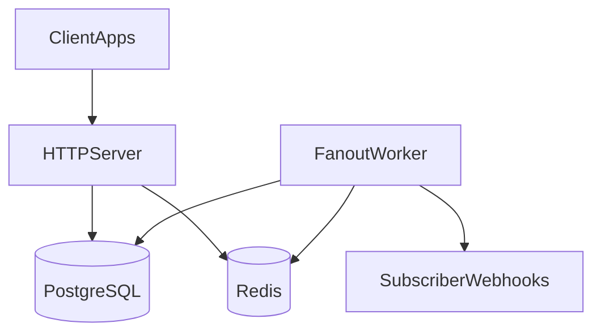

# Event Fanout Service

A production-oriented event ingestion and webhook fanout service. Clients POST structured events; the service persists them, matches subscriptions by filter rules, and delivers notifications to registered webhook endpoints with retry and audit capabilities.

**Stack:** Go · PostgreSQL 15 · Redis 7 · Docker · Helm · GitHub Actions

## Overview

The Event Fanout Service routes events to interested subscribers based on filter rules. It is designed for durable ingestion, asynchronous fanout, exponential-backoff retries, and a full delivery audit trail.

| Capability | Status |
|------------|--------|
| Event ingestion API | Implemented |
| Subscription CRUD | Implemented |
| Rules matcher (type/source) | Implemented |
| Background worker + webhook delivery | Planned |
| Delivery audit HTTP endpoints | Planned |
| Redis Streams queue | Planned (currently Redis list) |

See [Implementation Status](docs/project-details.md#implementation-status) for details.

## Quick Start

**Prerequisites:** Docker, Docker Compose, curl

```bash
git clone https://github.com/event-fanout-service/event-fanout.git
cd event-fanout
make up
```

Verify the service is running:

```bash
curl http://localhost:8080/health
```

Create a subscription:

```bash
curl -X POST http://localhost:8080/api/v1/subscriptions \
  -H "Content-Type: application/json" \
  -d '{
    "webhook_url": "http://webhook.example.com/events",
    "rules": {"type": "user.created", "source": "auth-service"}
  }'
```

Ingest an event:

```bash
curl -X POST http://localhost:8080/api/v1/events \
  -H "Content-Type: application/json" \
  -d '{
    "type": "user.created",
    "source": "auth-service",
    "payload": {"user_id": "123", "email": "user@example.com"}
  }'
```

For native Go setup, Helm deployment, troubleshooting, and a full walkthrough, see [Getting Started](docs/getting-started.md).

## Documentation

| Document | Description |
|----------|-------------|
| [Getting Started](docs/getting-started.md) | Docker Compose, native Go, Helm, end-to-end tutorial |
| [Project Details](docs/project-details.md) | Repo layout, config, data model, Makefile, API surface |
| [Architecture](docs/architecture.md) | System diagrams, data flows, deployment topology |

## Features

- **Event Ingestion** — REST endpoint accepts structured JSON events, persisted to PostgreSQL
- **Subscription Management** — CRUD for webhooks with JSON filter rules
- **Rules Engine** — Match events by type and source (payload rules planned)
- **Async Fanout** — Worker-based delivery to matching subscribers *(planned)*
- **Retry with Backoff** — Exponential backoff for failed deliveries *(planned)*
- **Delivery Audit** — Query delivery history per event or subscription *(planned)*
- **Docker & Kubernetes** — Multi-stage Docker build, Helm chart, GitHub Actions CI

## API Summary

| Method | Endpoint | Status | Description |
|--------|----------|--------|-------------|
| `GET` | `/health` | Implemented | Health check |
| `POST` | `/api/v1/events` | Implemented | Ingest an event |
| `POST` | `/api/v1/subscriptions` | Implemented | Create subscription |
| `GET` | `/api/v1/subscriptions` | Implemented | List subscriptions |
| `GET` | `/api/v1/subscriptions/{subId}` | Implemented | Get subscription |
| `PUT` | `/api/v1/subscriptions/{subId}` | Implemented | Update subscription |
| `DELETE` | `/api/v1/subscriptions/{subId}` | Implemented | Delete subscription (soft) |
| `GET` | `/api/v1/events/{eventId}` | Planned | Retrieve event |
| `GET` | `/api/v1/events/{eventId}/audit` | Planned | Delivery audit for event |
| `GET` | `/api/v1/subscriptions/{subId}/audit` | Planned | Delivery audit for subscription |

Request/response examples and filter rule syntax are in [Project Details](docs/project-details.md#api-surface).

## Architecture

High-level system design:



The worker and webhook delivery path are planned. See [Architecture](docs/architecture.md) for component diagrams, sequence flows, and deployment topology.

## Development

```bash
make build          # Build server and worker binaries
make test           # Run unit tests
make test-coverage  # Tests with coverage report
make lint           # Run golangci-lint
make fmt            # Format code and tidy modules
make logs           # Tail docker-compose logs
```

## Contributing

1. Fork the repository
2. Create a feature branch: `git checkout -b feature/my-feature`
3. Commit changes: `git commit -am 'Add feature'`
4. Push branch: `git push origin feature/my-feature`
5. Open a Pull Request

## License

MIT License — see [LICENSE](LICENSE).

## Support

- GitHub Issues: [event-fanout/issues](https://github.com/event-fanout-service/event-fanout/issues)
