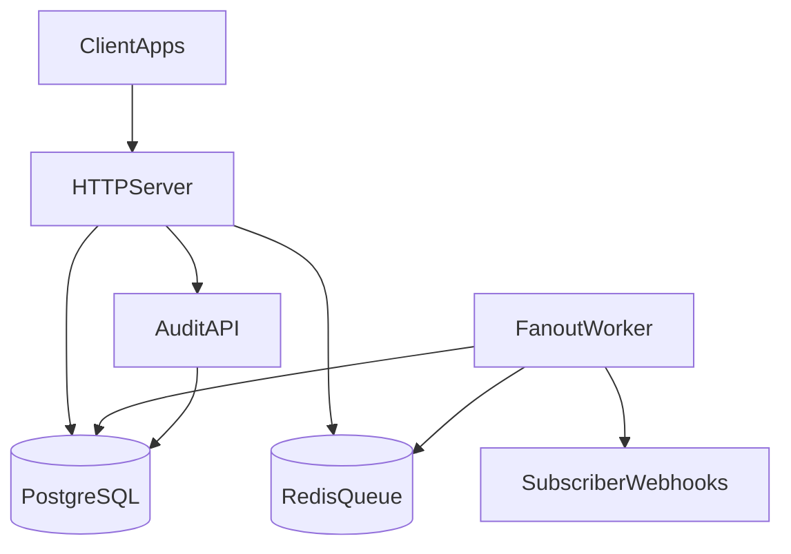

# Event Fanout Service

A production-ready event ingestion and webhook fanout service. Clients POST structured events; the service persists them durably, matches subscriptions by filter rules, and delivers notifications to registered webhook endpoints with retry, audit, and observability.

**Stack:** Go · PostgreSQL 15 · Redis 7 · Docker · Helm · DOKS · GitHub Actions

## Overview

| Capability | Status |
|------------|--------|
| Durable event ingestion (`POST /api/v1/events`) | Implemented |
| Subscription CRUD with filter rules | Implemented |
| Async fanout + webhook delivery | Implemented |
| Retry with exponential backoff | Implemented |
| Delivery audit endpoints | Implemented |
| DOKS deployment (Helm + GitHub Actions) | Implemented |

## Quick Start

```bash
git clone https://github.com/shwetaudacious/event-fanout.git
cd event-fanout
make up
curl http://localhost:8080/health
```

Create a subscription and ingest an event:

```bash
curl -X POST http://localhost:8080/api/v1/subscriptions \
  -H "Content-Type: application/json" \
  -d '{"webhook_url":"https://webhook.site/your-id","rules":{"type":"user.created"}}'

curl -X POST http://localhost:8080/api/v1/events \
  -H "Content-Type: application/json" \
  -d '{"type":"user.created","source":"auth-service","payload":{"user_id":"123"}}'
```

See [Getting Started](docs/getting-started.md) for native Go setup, testing, and troubleshooting.

## Documentation

| Document | Description |
|----------|-------------|
| [Getting Started](docs/getting-started.md) | Local setup and end-to-end walkthrough |
| [Architecture](docs/architecture.md) | Flow diagrams from ingest → fanout → audit |
| [Project Details](docs/project-details.md) | Config, data model, API reference |
| [DOKS Deployment](docs/doks-deployment.md) | Deploy to DigitalOcean Kubernetes |

## Architecture



Full sequence diagrams: [docs/architecture.md](docs/architecture.md)

## API Summary

| Method | Endpoint | Description |
|--------|----------|-------------|
| `GET` | `/health` | Health check (DB + Redis) |
| `POST` | `/api/v1/events` | Ingest event |
| `GET` | `/api/v1/events/{eventId}` | Get event |
| `GET` | `/api/v1/events/{eventId}/audit` | Delivery audit for event |
| `POST` | `/api/v1/subscriptions` | Create subscription |
| `GET` | `/api/v1/subscriptions` | List subscriptions |
| `GET/PUT/DELETE` | `/api/v1/subscriptions/{subId}` | Manage subscription |
| `GET` | `/api/v1/subscriptions/{subId}/audit` | Delivery audit for subscription |

## Filter Rule Syntax

```json
{
  "type": "user.*",
  "source": "auth-service",
  "payload_rules": [
    {"path": "$.role", "op": "==", "value": "admin"},
    {"path": "$.amount", "op": ">", "value": 1000}
  ]
}
```

Operators: `==`, `!=`, `>`, `<`, `>=`, `<=`, `in`, `regex`. See [Project Details](docs/project-details.md#filter-rule-syntax).

## Delivery Guarantees

**Semantics: at-least-once per subscriber.**

- Events are written to PostgreSQL before enqueueing to Redis.
- Each matching subscription gets a `delivery_attempts` row; failed deliveries are retried with exponential backoff until `MAX_DELIVERY_RETRIES`.
- HTTP 4xx responses are marked failed without retry (client error).
- HTTP 5xx, timeouts, and network errors are retried.

**Subscriber responsibility:** implement idempotency using the event `id` in the webhook payload.

**Failure conditions:**

| Scenario | Behavior |
|----------|----------|
| DB unavailable during ingest | Request fails with 500; event not accepted |
| Redis unavailable during ingest | Request fails with 500 after DB write (requires ops reconciliation) |
| Webhook timeout / 5xx | Retried with backoff |
| Webhook 4xx | Marked failed, no retry |
| Max retries exceeded | Marked failed permanently |

## Testing

```bash
make test                                    # Unit tests
go test -tags=integration ./tests/integration/...  # Integration tests (requires Postgres + Redis)
```

CI runs both unit and integration test jobs on every push.

## DOKS Deployment

Deploy to DigitalOcean Kubernetes using Helm:

```bash
helm upgrade --install event-fanout ./helm/eventfanout \
  -n event-fanout --create-namespace \
  --set secrets.databaseURL="$DATABASE_URL" \
  --set secrets.redisURL="$REDIS_URL"
```

GitHub Actions deploys automatically after a successful image build. See [DOKS Deployment](docs/doks-deployment.md).

Required secrets: `DIGITALOCEAN_ACCESS_TOKEN`, `DATABASE_URL`, `REDIS_URL`.

## What We Sacrifice for Simplicity vs. What We'd Harden Next

| Simplified now | Would harden next |
|----------------|-------------------|
| Redis list queue (not Streams) | Redis Streams with consumer groups for horizontal worker scaling |
| No transactional outbox | Outbox pattern for exactly-once enqueue after DB commit |
| At-least-once delivery | Idempotency keys + dedup store for effectively-once |
| No webhook HMAC signing | HMAC-SHA256 signature headers for authenticity |
| Basic health checks | Deep readiness probes + circuit breakers per webhook |
| No metrics/tracing | OpenTelemetry metrics, dashboards, distributed tracing |
| Single-region | Multi-region active-active with CRDT/event replay |
| No DLQ | Dead-letter queue with manual replay tooling |

## Development

```bash
make build          # Build server + worker binaries
make up             # Start full stack (server, worker, postgres, redis)
make test           # Unit tests
go test -tags=integration ./tests/integration/...  # Integration tests
make lint           # golangci-lint
make logs-worker    # Watch webhook delivery logs
```

## License

MIT — see [LICENSE](LICENSE).

## Support

[GitHub Issues](https://github.com/shwetaudacious/event-fanout/issues)
