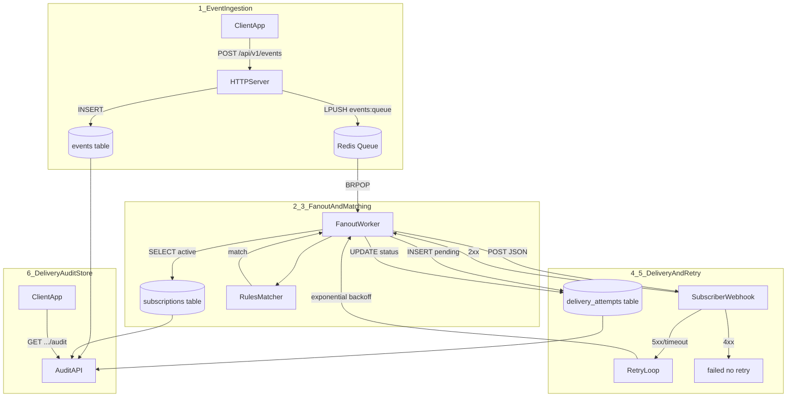
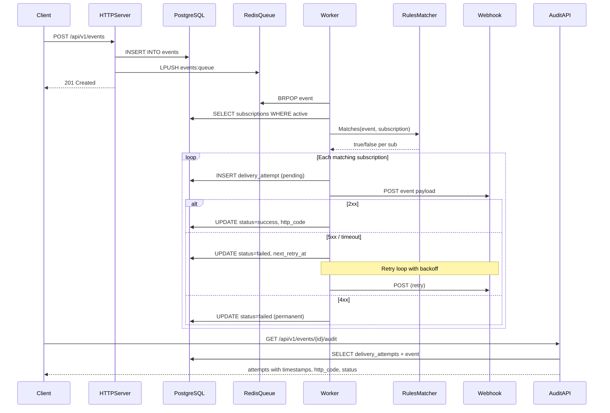
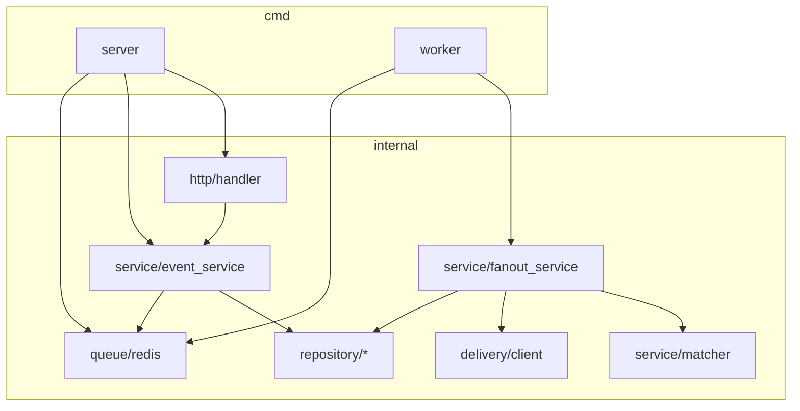
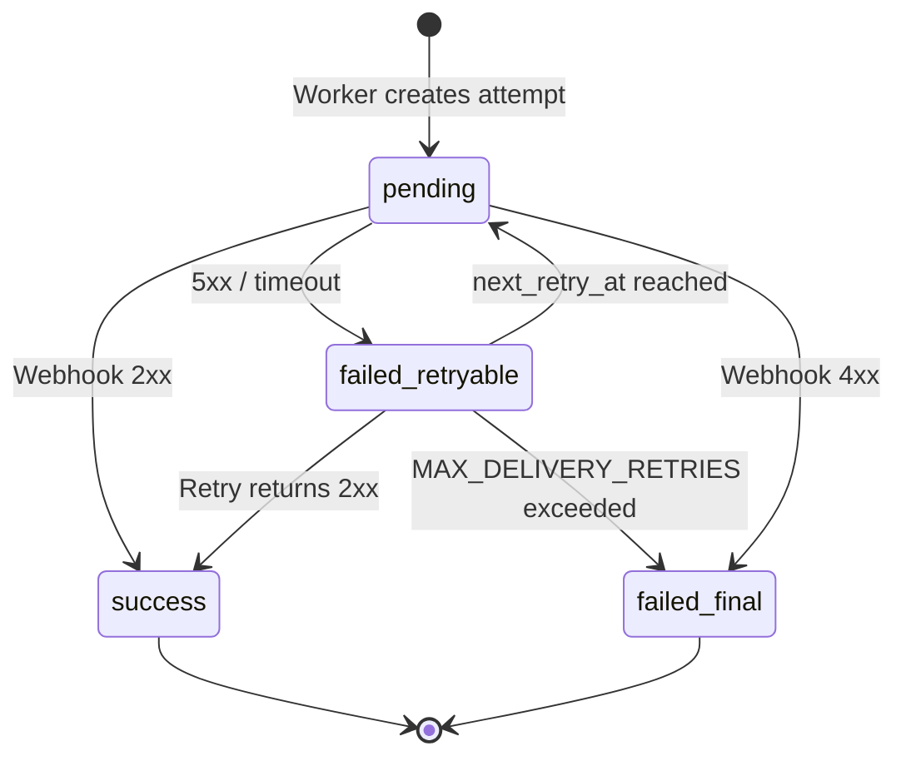
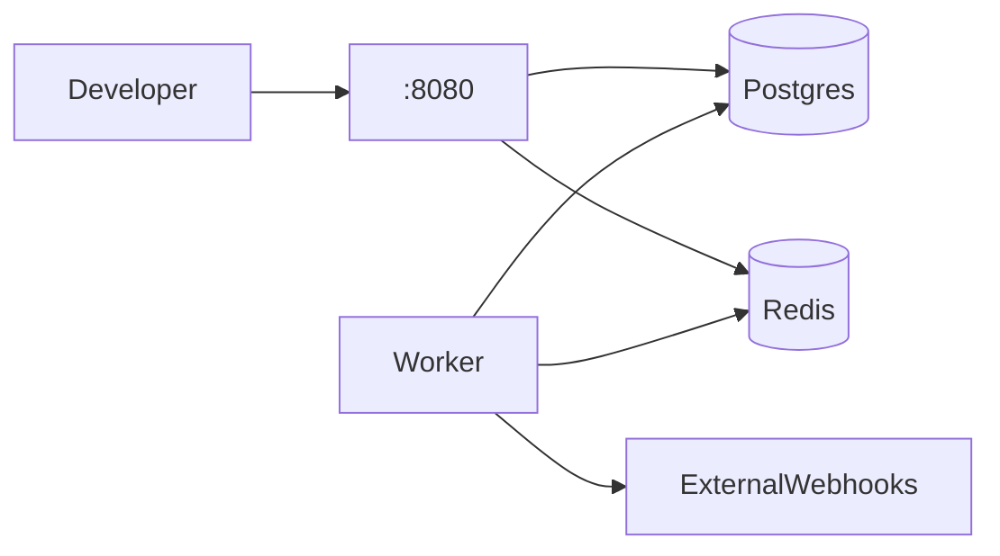

# Architecture

System design for the Event Fanout Service — full path from event ingest through subscriber matching, fanout, retry loop, and delivery audit store.

## Full Architecture Flow

The diagram below maps every stage in order. Numbers match the step descriptions.

### Step-by-step

| Step | Stage | Component | Action | Store |
|------|-------|-----------|--------|-------|
| 1 | **Ingest** | HTTP Server | Validate `type`, `source`, `payload`; persist event | `events` (PostgreSQL) |
| 2 | **Enqueue** | HTTP Server | Push event JSON to Redis list | `events:queue` (Redis) |
| 3 | **Consume** | Worker | Block on `BRPOP`; deserialize event | — |
| 4 | **Match** | Rules Matcher | Load active subscriptions; filter by type, source, payload rules | `subscriptions` (read) |
| 5 | **Deliver** | Fanout Service | Create `delivery_attempts` row (`pending`); POST to webhook URL | `delivery_attempts` (write) |
| 6 | **Record** | Fanout Service | On 2xx → `success`; on 5xx/timeout → schedule retry; on 4xx → `failed` | `delivery_attempts` (update) |
| 7 | **Retry loop** | Worker | Poll `next_retry_at`; re-POST with backoff until success or max retries | `delivery_attempts` (update) |
| 8 | **Audit** | Audit API | Join event + attempts + subscription webhook URL; return history | `delivery_attempts` (read) |

---

## End-to-End Sequence

---

## Component Diagram

---

## Retry Loop

Backoff: `BASE_RETRY_DELAY_SECONDS × 2^(attempt-1)`

---

## Data Stores

| Store | Table / Key | Written by | Read by |
|-------|-------------|------------|---------|
| PostgreSQL | `events` | Ingest API | Audit API, Worker |
| PostgreSQL | `subscriptions` | Subscription API | Worker (matcher) |
| PostgreSQL | `delivery_attempts` | Worker | Audit API, Retry poller |
| Redis | `events:queue` | Ingest API | Worker |

---

## Deployment Topology

### Local (Docker Compose)

### Production (DOKS)

See [DOKS Deployment](doks-deployment.md).

---

## Related

- [Delivery Guarantees](delivery-guarantees.md)
- [Project Details](project-details.md)
- [Getting Started](getting-started.md)
