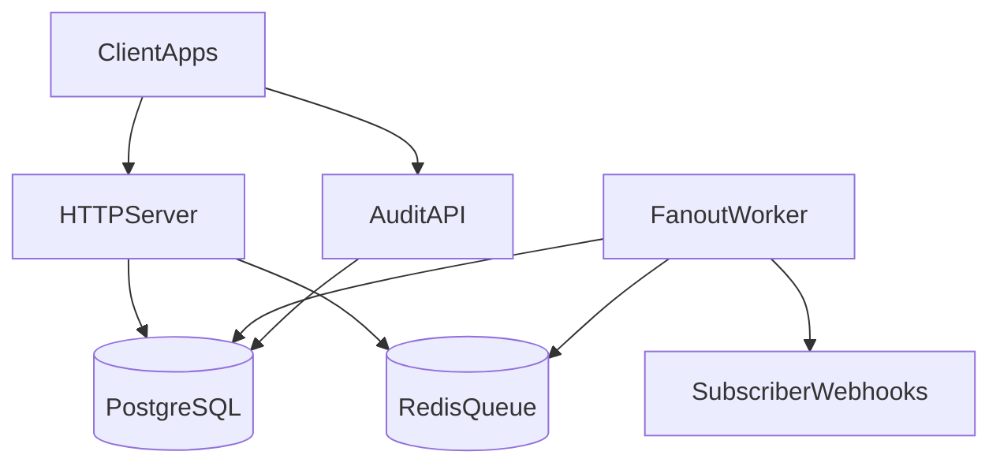
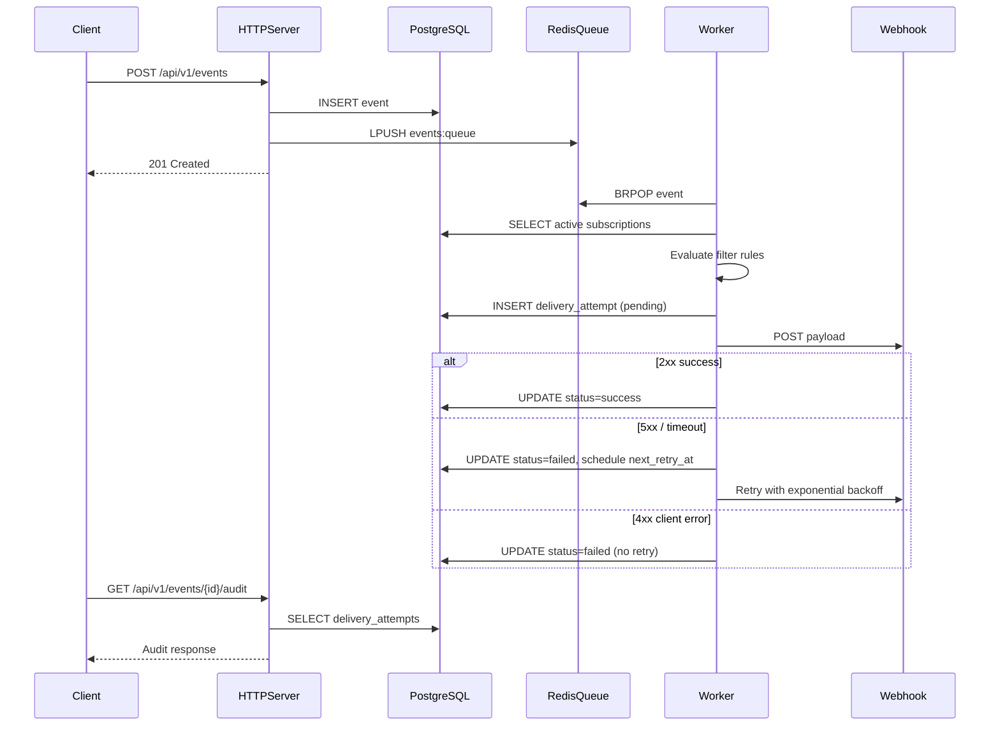
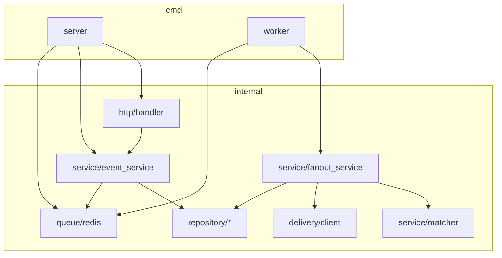
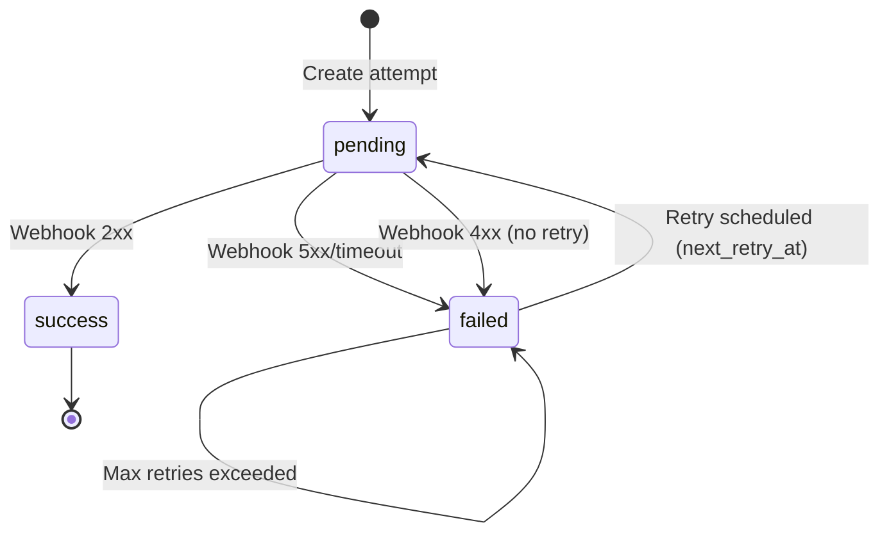
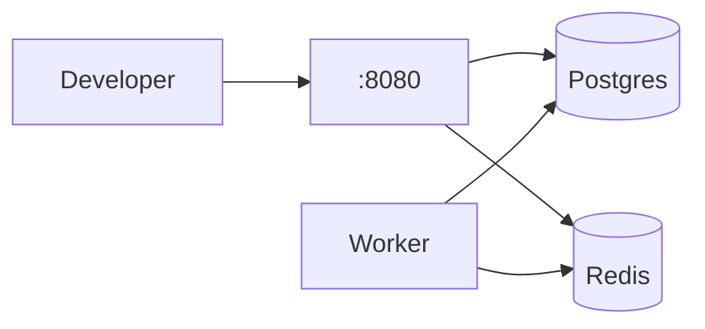

# Architecture

System design for the Event Fanout Service — from event ingest through subscriber matching, fanout, retry loop, and delivery audit.

## System Context

| Component | Role |
|-----------|------|
| **HTTP Server** | Ingest events, manage subscriptions, serve audit queries |
| **PostgreSQL** | Durable store: events, subscriptions, delivery_attempts |
| **Redis** | Async queue decoupling ingestion from fanout |
| **Fanout Worker** | Consumes queue, matches rules, delivers webhooks, retries |
| **Audit API** | Query delivery history per event or subscription |

---

## End-to-End Flow

---

## Component Diagram

---

## Retry Loop

Backoff formula: `BASE_RETRY_DELAY_SECONDS × 2^(attempt-1)`

---

## Deployment Topology

### Local (Docker Compose)

### Production (DOKS)

See [DOKS Deployment](doks-deployment.md) for managed PostgreSQL, Redis, LoadBalancer, and GitHub Actions deploy pipeline.

---

## Delivery Guarantees

**At-least-once** per matching subscriber. See [README — Delivery Guarantees](../README.md#delivery-guarantees).

---

## Related

- [Project Details](project-details.md)
- [Getting Started](getting-started.md)
