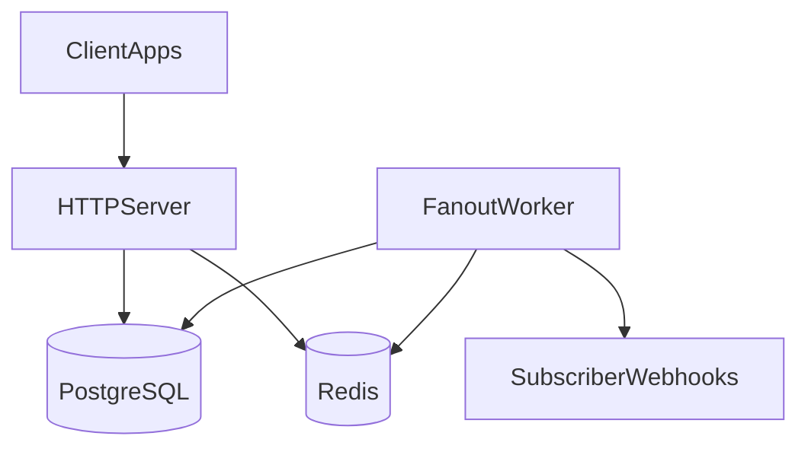
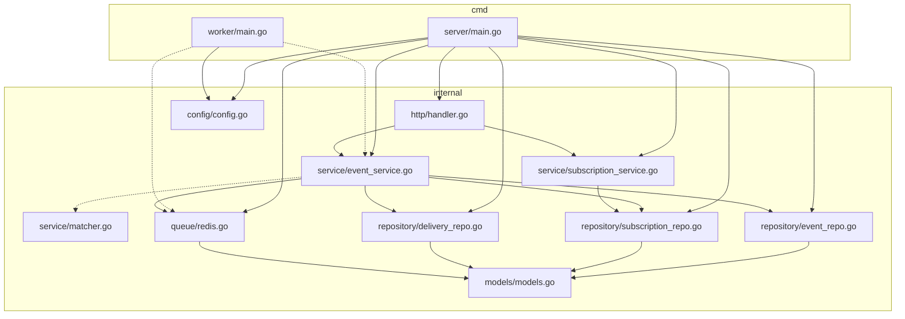
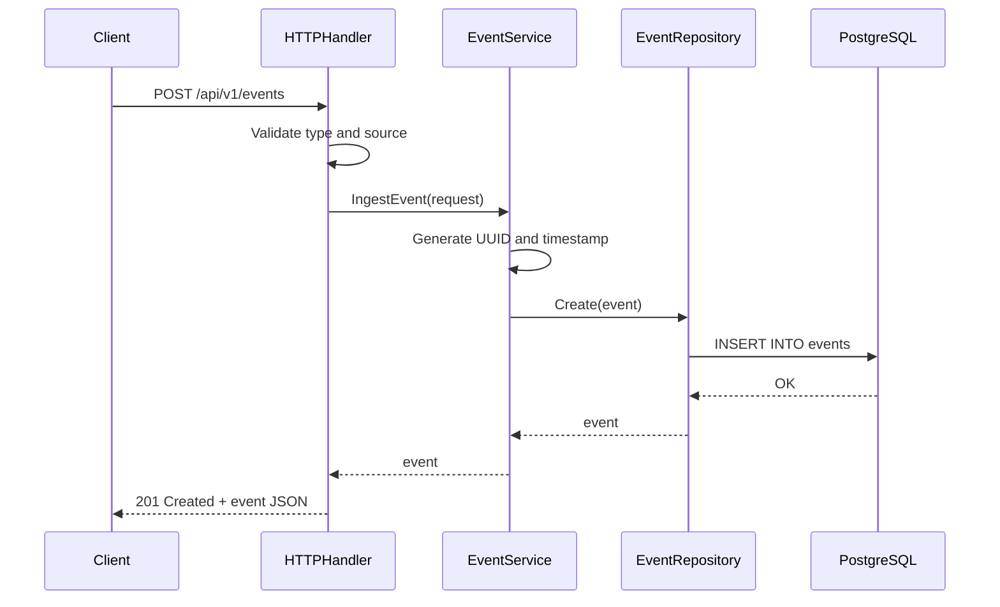
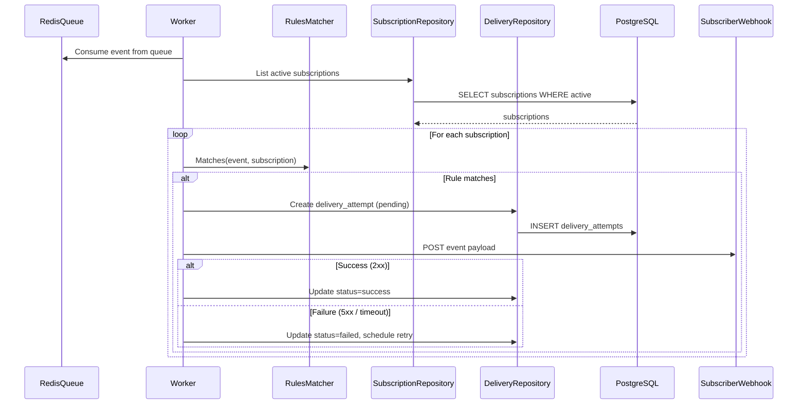
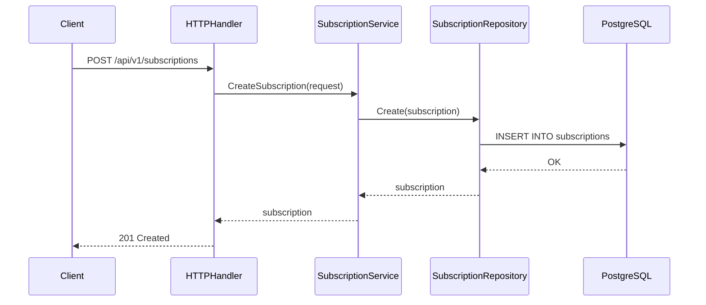
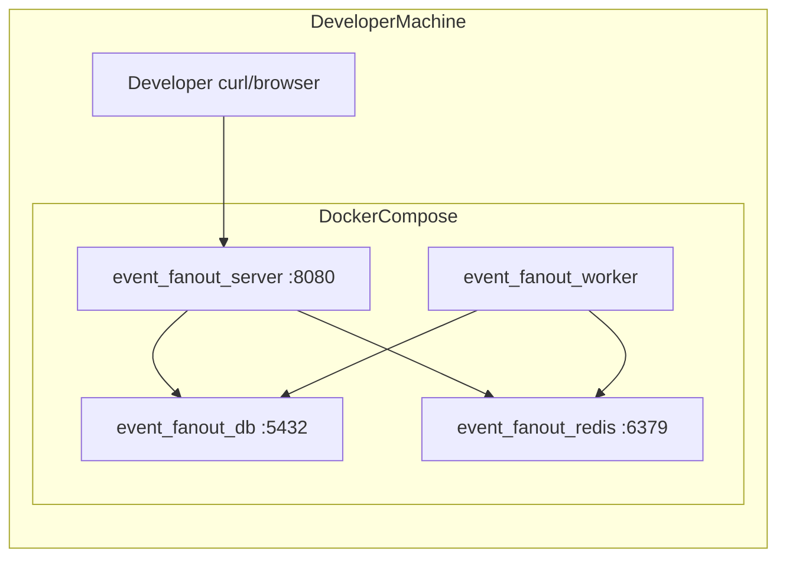
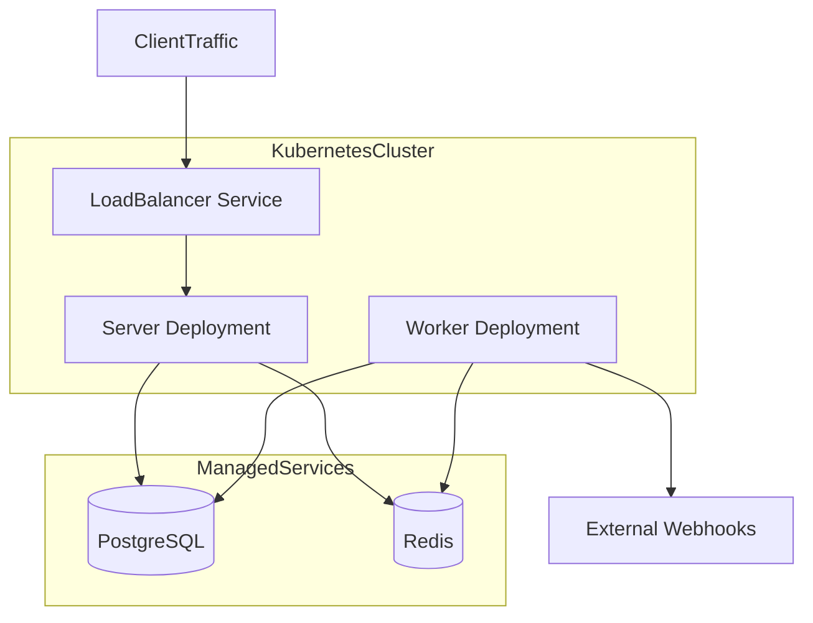

# Architecture

System design documentation for the Event Fanout Service. Diagrams marked **current** reflect implemented behavior; diagrams marked **planned** describe the target design.

---

## System Context

**Status: mixed (server current, worker planned)**

Shows the major components and external dependencies at the highest level.



| Component | Role |
|-----------|------|
| **Client Apps** | Produce events and manage subscriptions via REST |
| **HTTP Server** | Validates requests, persists events, manages subscriptions |
| **PostgreSQL** | Durable store for events, subscriptions, delivery attempts |
| **Redis** | Async event queue between ingestion and processing |
| **Fanout Worker** | Consumes queue, matches rules, delivers webhooks |
| **Subscriber Webhooks** | Downstream HTTP endpoints receiving event notifications |

The HTTP server and PostgreSQL path is live today. The worker → webhook path is planned.

---

## Component Diagram

**Status: current structure, partial implementation**

Internal package layout and dependencies.



Solid lines are wired today. Dashed lines (`-.->`) indicate planned connections (worker processing loop, matcher invocation during fanout).

### Package responsibilities

| Package | Responsibility |
|---------|---------------|
| `cmd/server` | Boot HTTP server, wire dependencies, graceful shutdown |
| `cmd/worker` | Boot background processor *(stub)* |
| `internal/http` | Route registration and request/response handling |
| `internal/service` | Business logic: ingestion, subscription management, rules matching |
| `internal/repository` | PostgreSQL CRUD for events, subscriptions, delivery attempts |
| `internal/queue` | Redis list adapter (`events:queue`) |
| `internal/config` | Environment variable configuration |
| `internal/models` | Domain types shared across layers |

---

## Event Ingestion Flow

**Status: current**

Sequence from client POST to durable storage.



After persistence the handler returns immediately. Enqueueing to Redis and triggering the worker is planned as a follow-on step in the ingestion path.

---

## Target Fanout Flow (Planned)

**Status: planned**

How events will be processed and delivered once the worker is implemented.



### Retry behavior (planned)

Failed deliveries will use exponential backoff:

```
delay = BASE_RETRY_DELAY_SECONDS * 2^(attempt - 1)
```

Capped by `MAX_DELIVERY_RETRIES`. HTTP 4xx responses will not be retried (client error).

---

## Subscription Management Flow

**Status: current**



Delete operations soft-deactivate subscriptions (`active = false`) rather than removing rows.

---

## Deployment Topology

**Status: current (Docker Compose), planned (Kubernetes fanout)**

### Local — Docker Compose



Both server and worker are built from the same multi-stage Dockerfile. Postgres runs the init migration on first start.

### Kubernetes — Helm (target)



The Helm chart under `helm/eventfanout/` defines server deployment, service, HPA, and service account. Configure `values.yaml` for image registry, resource limits, and ingress.

---

## Data Flow Summary

| Stage | Current | Planned |
|-------|---------|---------|
| 1. Ingest | Client → Server → PostgreSQL | Same |
| 2. Enqueue | — | Server → Redis queue |
| 3. Process | — | Worker reads queue |
| 4. Match | Matcher exists, not invoked | Worker → RulesMatcher → subscriptions |
| 5. Deliver | — | Worker → HTTP POST to webhook |
| 6. Retry | — | Exponential backoff on failure |
| 7. Audit | Service methods exist | HTTP endpoints + DB query |

---

## Observability

### Logging (current)

Server and worker emit structured JSON logs via zap:

```json
{"level":"info","caller":"service/event_service.go:56","msg":"event ingested","event_id":"550e8400-e29b-41d4-a716-446655440000"}
```

Configure verbosity with `LOG_LEVEL` (`debug`, `info`, `warn`, `error`).

### Metrics (planned)

OpenTelemetry integration planned for:

- Event ingestion rate
- Delivery success/failure rate
- Retry attempt count
- Webhook latency (p50/p99)
- Queue depth

### Audit trail (planned)

Query delivery history via:

- `GET /api/v1/events/{eventId}/audit`
- `GET /api/v1/subscriptions/{subId}/audit`

---

## Design Trade-offs

| Decision | Rationale |
|----------|-----------|
| At-least-once delivery | Simpler than exactly-once; subscribers deduplicate by event ID |
| PostgreSQL as source of truth | Durable ingestion before async processing |
| Redis for queue | Low-latency decoupling between API and worker |
| Separate server/worker binaries | Independent scaling and deployment |
| Soft-delete subscriptions | Preserve audit history for inactive subscriptions |

---

## Related Documentation

- [Project Details](project-details.md) — configuration, data model, API reference
- [Getting Started](getting-started.md) — local setup and walkthrough
