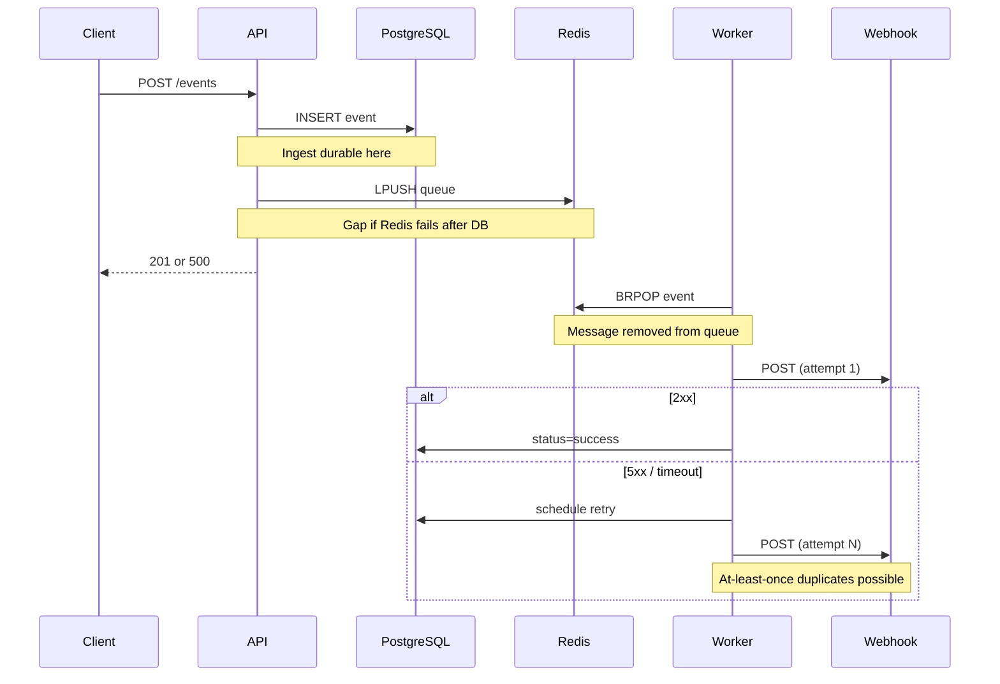
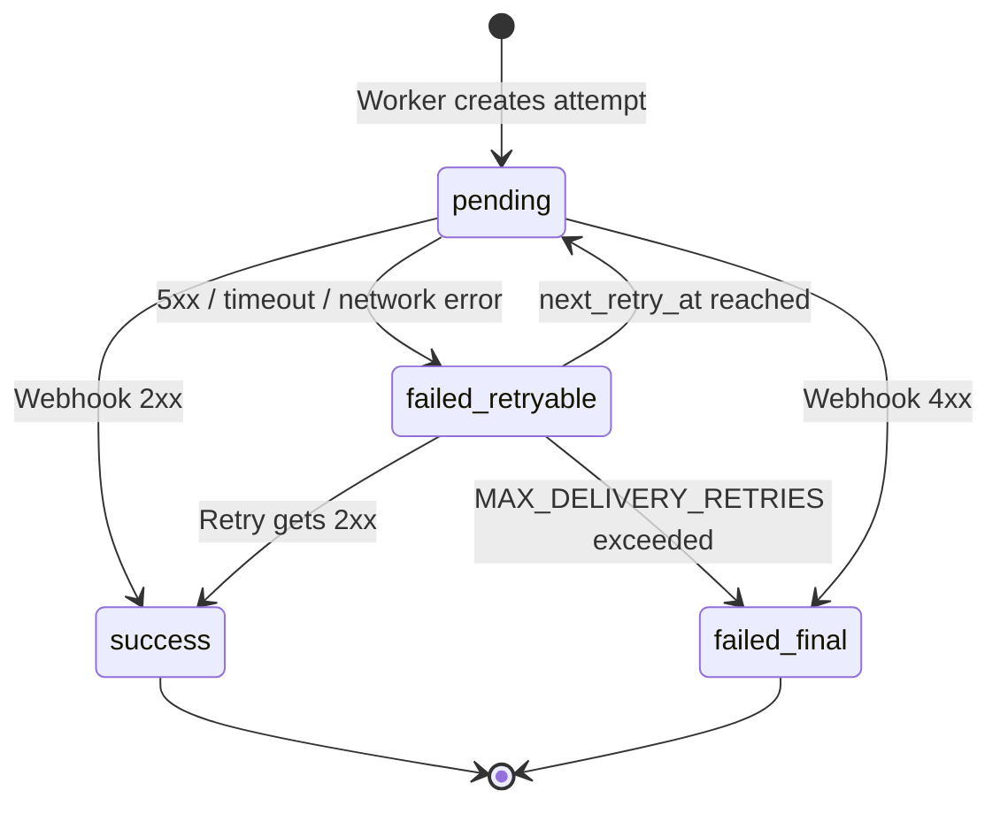

# Delivery Guarantees

This document describes the delivery semantics of the Event Fanout Service: what is guaranteed, what is not, and how the system behaves under failure.

## Summary

| Scope | Guarantee | Notes |
|-------|-----------|-------|
| **Event ingestion** (client → API) | **At-most-once accept** | A `201` means the event is durably stored; duplicate client retries with the same payload create **new** events (new UUIDs) |
| **Event fanout** (API → queue → worker) | **At-least-once processing intent** | Persist-then-enqueue; Redis failure after DB write can leave a stored event without fanout |
| **Webhook delivery** (worker → subscriber) | **At-least-once per subscriber** | Retries on failure can cause duplicate POSTs to the same webhook |
| **Exactly-once** | **Not supported** | Requires subscriber-side idempotency or future outbox/dedup infrastructure |

**Per-subscriber answer:** the design targets **at-least-once** delivery. A matching subscriber may receive the same event more than once; they will not receive fewer than one successful delivery unless all retries are exhausted or a non-retryable error occurs.

---

## Semantics Explained

### At-least-once (what we provide for webhooks)

For each `(event, subscription)` pair the worker:

1. Creates a single `delivery_attempts` row (unique constraint on `event_id + subscription_id`)
2. POSTs the event to the subscriber webhook
3. Retries on transient failure with exponential backoff until `MAX_DELIVERY_RETRIES`

If the webhook returns **2xx**, the attempt is marked `success` and no further retries occur for that pair.

**Why duplicates can happen:**

| Cause | Mechanism |
|-------|-----------|
| Retry after timeout | Worker times out; webhook may have processed the request; retry sends again |
| Crash before status update | Webhook succeeds but worker dies before writing `success` to DB |
| Ambiguous HTTP response | Connection reset after server handled the request |

The service does **not** treat a successful HTTP response as an idempotency token — each retry is a new POST.

### At-most-once (what we do NOT guarantee for webhooks)

At-most-once would mean each subscriber receives an event **zero or one** time, never more. We explicitly **do not** provide this because:

- Failed deliveries are retried by design
- There is no distributed transaction between webhook acknowledgment and our status update
- There is no deduplication window on the subscriber side enforced by this service

**Under-delivery** (zero deliveries) *can* occur — see failure conditions below.

### Exactly-once (what we do NOT provide)

Exactly-once would mean each subscriber processes each event **exactly one** time. This requires either:

- A transactional outbox + idempotent consumer with shared dedup state, or
- Two-phase commit between our service and every subscriber

Neither is implemented. Subscribers **must** deduplicate using the event `id` field in the webhook payload:

```json
{
  "id": "550e8400-e29b-41d4-a716-446655440000",
  "type": "user.created",
  "source": "auth-service",
  "payload": { ... },
  "created_at": "2026-06-23T10:00:00Z"
}
```

---

## End-to-End Flow and Guarantee Boundaries



---

## Failure Conditions

### Ingestion phase

| Failure | Client sees | Event in DB | Event in queue | Fanout happens |
|---------|-------------|-------------|----------------|----------------|
| PostgreSQL down | `500` | No | No | No |
| PostgreSQL write fails | `500` | No | No | No |
| Redis enqueue fails (after DB write) | `500` | **Yes** | No | **No** — ops must re-enqueue or replay |
| Success path | `201` | Yes | Yes | Yes (when worker consumes) |

**Important:** ingestion is **not** atomic across PostgreSQL and Redis. A stored event with no queue entry is an **under-delivery** scenario requiring manual or automated reconciliation.

### Fanout / worker phase

| Failure | Effect |
|---------|--------|
| Worker down | Events accumulate in Redis queue; delivered when worker resumes |
| Worker crash after `BRPOP` | Event removed from Redis; if processing incomplete, event may not fanout unless replayed from DB (not automated today) |
| No matching subscriptions | Event stored; no `delivery_attempts` rows created |
| Rule evaluation error | Subscription skipped for that event; logged as warning |

### Webhook delivery phase (per subscriber)

| Condition | HTTP code | Retries | Final status | Subscriber receives |
|-----------|-----------|---------|--------------|---------------------|
| Success | 2xx | No | `success` | Event (once per successful attempt; duplicates possible across attempts) |
| Server error | 5xx | Yes (backoff) | `success` or `failed` | At-least-once if any attempt succeeds |
| Network timeout / connection error | — | Yes (backoff) | `success` or `failed` | At-least-once if any attempt succeeds |
| Client error | 4xx | **No** | `failed` | **Zero** (permanent failure for this pair) |
| Max retries exceeded | 5xx / timeout | Stopped | `failed` | **Zero** (all attempts failed) |

Retry delay: `BASE_RETRY_DELAY_SECONDS × 2^(attempt_number - 1)`  
Default: 5s → 10s → 20s → 40s → 80s (with `MAX_DELIVERY_RETRIES=5`).

### Infrastructure failures

| Failure | Ingestion | Queued events | In-flight deliveries | Audit data |
|---------|-----------|---------------|----------------------|------------|
| PostgreSQL outage | Rejected | Worker cannot update status | Stuck / fail | Unavailable |
| Redis outage | Enqueue fails after DB write | N/A | Worker cannot dequeue new events | PG audit intact |
| Redis data loss | Unaffected (already accepted) | **Lost** if not yet consumed | Unaffected | PG audit intact |
| Worker pod crash | Unaffected | Consumed message may be lost mid-process | May duplicate on retry | Partial state in PG |

---

## Delivery State Machine

Each `(event_id, subscription_id)` pair tracks one logical delivery:



Query state via:

- `GET /api/v1/events/{eventId}/audit`
- `GET /api/v1/subscriptions/{subId}/audit`

---

## Subscriber Responsibilities

Because delivery is **at-least-once**, every webhook handler must:

1. **Extract** the event `id` from the JSON body (or `X-Event-Id` header)
2. **Check** whether that `id` was already processed (DB lookup, cache, etc.)
3. **Process** only if new; return 2xx for duplicates to stop retries
4. **Return 2xx quickly** after durable local processing to minimize timeout retries

Returning **4xx** for transient internal errors will permanently stop delivery for that event/subscription pair.

---

## Path to Stronger Guarantees

| Target | Approach |
|--------|----------|
| **Effectively-once** (subscriber view) | Idempotency keys + dedup store; subscriber returns 2xx on duplicate |
| **Exactly-once enqueue** | Transactional outbox: DB write + outbox row in one transaction; relay to Redis |
| **No lost queue messages** | Redis Streams with consumer groups + pending entry reclaim |
| **Stronger ingest atomicity** | Two-phase accept or saga between DB and queue |

See [README — Trade-offs](../README.md#what-we-sacrifice-for-simplicity-vs-what-wed-harden-next) for the project roadmap.

---

## Related

- [Architecture](architecture.md) — flow diagrams
- [Project Details](project-details.md) — configuration and API reference
