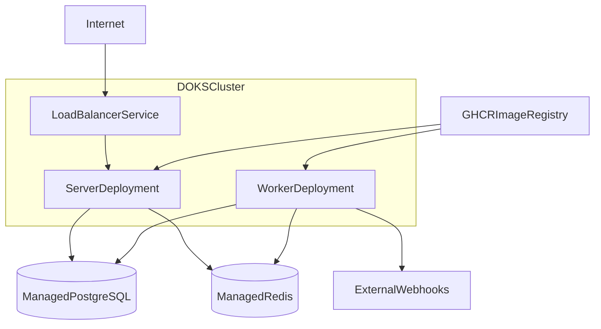

# DOKS Deployment Guide

Deploy the Event Fanout Service to **DigitalOcean Kubernetes (DOKS)** using Helm and GitHub Actions.

## Prerequisites

- DigitalOcean account with a DOKS cluster (`event-fanout-cluster` or update the workflow)
- Managed PostgreSQL and Redis (DigitalOcean Managed Databases recommended)
- Container image published to GHCR (`ghcr.io/shwetaudacious/event-fanout`)
- `doctl`, `kubectl`, and `helm` installed locally for manual deploys

## Architecture on DOKS



## 1. Provision Infrastructure

1. Create a DOKS cluster in the DigitalOcean control panel.
2. Create managed PostgreSQL 15 and Redis 7 instances in the same VPC/region.
3. Note connection strings for both databases.

## 2. Configure GitHub Secrets

In your repository settings, add:

| Secret | Description |
|--------|-------------|
| `DIGITALOCEAN_ACCESS_TOKEN` | DO API token with Kubernetes read/write |
| `DATABASE_URL` | Managed Postgres connection URL |
| `REDIS_URL` | Managed Redis connection URL |

## 3. Manual Helm Deploy

```bash
# Authenticate to DOKS
doctl kubernetes cluster kubeconfig save event-fanout-cluster

# Deploy
helm upgrade --install event-fanout ./helm/eventfanout \
  --namespace event-fanout \
  --create-namespace \
  --set image.repository=ghcr.io/shwetaudacious/event-fanout \
  --set image.tag=latest \
  --set secrets.databaseURL="$DATABASE_URL" \
  --set secrets.redisURL="$REDIS_URL" \
  --set config.environment=production
```

## 4. Verify

```bash
kubectl get pods -n event-fanout
kubectl get svc -n event-fanout
kubectl logs -n event-fanout deployment/event-fanout-server
kubectl logs -n event-fanout deployment/event-fanout-worker
```

Port-forward for local testing:

```bash
kubectl port-forward -n event-fanout svc/event-fanout 8080:80
curl http://localhost:8080/health
```

## 5. Automated CI/CD Deploy

The repository includes:

- `.github/workflows/test.yml` — unit + integration tests on push
- `.github/workflows/build-push.yml` — builds and pushes image to GHCR on `main`
- `.github/workflows/deploy-doks.yml` — deploys to DOKS after successful build

Update `CLUSTER_NAME` in `deploy-doks.yml` if your cluster has a different name.

## Helm Values Reference

| Value | Description |
|-------|-------------|
| `image.repository` | Container image |
| `image.tag` | Image tag |
| `secrets.databaseURL` | PostgreSQL connection string |
| `secrets.redisURL` | Redis connection string |
| `config.maxDeliveryRetries` | Max webhook retry attempts |
| `config.workerReplicas` | Worker pod count |
| `autoscaling.enabled` | HPA for server pods |

## Run Database Migrations

Apply schema before first deploy:

```bash
psql "$DATABASE_URL" -f migrations/001_init_schema.sql
```

Or mount migrations as a Kubernetes Job in production pipelines.

## Related

- [Architecture](architecture.md)
- [Getting Started](getting-started.md)
